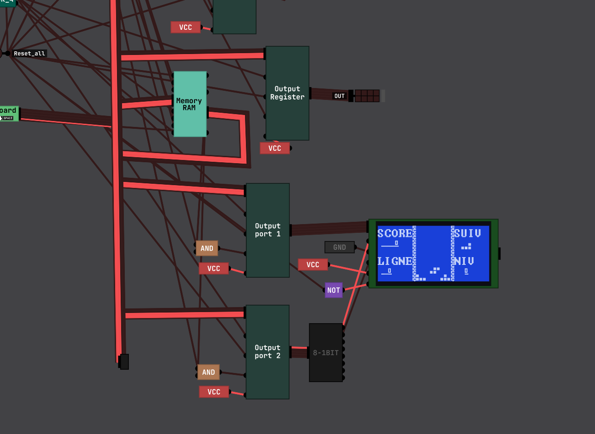

# Digital-Logic-Sim — fork with an AI assistant and circuit tools

This is a fork of [Sebastian Lague's Digital-Logic-Sim](https://github.com/SebLague/Digital-Logic-Sim)
(based on version 2.1.6). Everything below this section is the original project; this section lists
what the fork adds on top.

## What's new in this fork

### Simulation core rewritten: up to 90 000 times faster

`CPU_2`, the bundled project's current computer (8-bit CPU, 64 KB native RAM, ST7920 LCD, keyboard) running its
snake game, 70 steps per clock tick, Max speed, same machine (measured 4 Oct 2026):

| | steps per second | clock frequency | speed-up |
|---|---|---|---|
| original core | 1 390 | 9.9 Hz | |
| this fork, gates | 3 700 000 to 4 000 000 | 26 to 29 kHz | × 2 750 |
| this fork, RUN FAST | 122 000 000 to 133 000 000 | 870 to 950 kHz | **× 90 000** |

The fork's numbers are the real built app (`runRateTest.bat`, screen drawn at 60 fps, the LCD following the game).
The original core cannot load `CPU_2` as such (the native RAM and the LCD did not exist): it was measured in the
editor with those two chips replaced by an empty chip with the same pins — its tree walker visits every chip at every
step whatever they compute, so that does not change its cost, and the editor runs it faster than the built app would,
so the factor is if anything understated. RUN FAST (right-click on empty space) runs the chip's modules by models of
what they do; "gates" is the plain compiled simulation.

The older `CPU` chip (RAM built from latches, measured 27 Sep 2026, before RUN FAST), as it is actually used in the app — built-in clock, 70 steps per clock
tick, the control lines as saved in the chip so that every cycle does A = A + 1 and stores the value in RAM —
same chip, same settings, same machine:

| | steps per second | clock frequency |
|---|---|---|
| original core | 105 | 0.75 Hz |
| this fork | 3 500 000 to 4 900 000 | 25 to 35 kHz |

**35 000 / 0.75 ≈ 46 667 times faster** (33 000 at the low end of the range). The spread between runs comes from
the random order drawn for the CPU's feedback loop, which changes how many steps the registers take to settle.
The preferences menu shows the current clock frequency next to the current steps per second, so you can read it
on your own circuits.

How: the simulation no longer walks the chip tree object by object. The tree is compiled once into a flat list
of gates over a single array of pin states (a pin fed by one source shares its source's slot, so custom-chip
boundaries cost nothing), scheduled in the same order as before so latches, registers and buses keep exactly
the same tick-level behaviour, and recompiled only when the circuit is edited. A step only runs the gates whose
inputs changed, and the steps where nothing can change (no pending gate, no input moved, no clock edge due) are
skipped outright — an outside input is still seen within a fraction of a millisecond. Gates that cannot change
are not woken, a NAND followed by its inverter runs as one, and gates computing the same function of the same
inputs run once. A floating line costs nothing while idle: logic that reads it sees noise, re-drawn a few times
a second, and floating pins flicker on screen.

Measured with `Assets/Editor/SimBench.cs` (the original core checked out from git into a separate working copy
and driven through the same scenario), verified by the regression bench (153 cases, every chip of the CPU
project, see Tests below).

### Ask Claude — an AI assistant inside the editor
- A resizable chat panel (right side of the screen) where you describe the circuit you want and Claude
  builds it in the open project: it creates modules, adds inputs/outputs and components, wires them,
  renames pins and binds keys.
- **Quick command box**: press Space (or right-click > ASK CLAUDE), type a request (multi-line), Enter.
  Claude works in the background with a busy indicator at the top of the screen and a "done" toast;
  it writes no answer in that mode.
- Claude **tests its own work** with the real simulator before calling a module done: a truth table
  for combinational circuits, a step-by-step sequence (inputs, clock cycles, key presses) for
  sequential ones, reporting outputs, LEDs, 7-segment and pixel displays.
- Claude does **exactly what you asked and nothing more**; anything else it notices is reported, not
  changed.
- What Claude adds is laid out once, at the end of the request: a new module gets a full Clean Up, an
  existing chip keeps its layout and the new parts are slotted into the matching column next to what
  they connect to.
- **One Ctrl+Z reverts a whole request** on each chip it touched; **Esc while Claude works** cancels it
  and reverts everything it did.
- Nothing is auto-saved: Claude's edits sit in memory exactly like your own until you save. The
  conversation is stored with the project and restored when you reopen it. You can keep typing while
  Claude is working; your message is taken into account mid-task.
- Requires an Anthropic API key in the `ANTHROPIC_API_KEY` environment variable.

### Circuit optimisation tools (right-click a custom chip in the bottom bar)
- **Count nand** — how many NAND gates the chip needs once fully expanded.
- **Nand only** — flattens the whole hierarchy into a single chip made of builtin primitives.
- **Optimise** — rebuilds a combinational chip out of a palette of gate packages (AND, OR, XOR, NOT,
  NAND, NOR… with several gates per package) while minimising the number of packages. Uses
  AIG rewriting, observability don't-cares and cut-based technology mapping. Every generated chip is
  verified against the original over its whole input space before anything is written.
- Both reports also show the circuit depth (longest gate chain from an input to an output).

### Editor quality of life
- **A project ships with the app**: the `PC` project (an 8-bit CPU: registers, ALU, bus, RAM, all built from
  NAND gates) is installed on first launch. If you already have a project with that name and modified it, the
  app asks whether to keep yours or replace it (yours is moved to "Deleted Projects", nothing is lost); an
  untouched copy is updated silently.
- **Memory is saved, and editable word by word**: saving a chip saves the state of all its memory (registers,
  counters, RAM made of latches, builtin RAM), edited or not, and it comes back when the chip is reopened.
  Right-click a chip > **EDIT MEMORY** to type its words directly (hexadecimal, decimal or binary, copy / paste
  all): Claude works out how the chip's memory cells form words, and the layout is checked by simulation before
  the editor opens — a wrong guess is caught and corrected, never used.
- **Input values are saved**: the values set on a chip's input pins are stored with the chip and are there
  again when it is reopened (the original never saved them).
- **Right-click on empty space** opens a menu with three entries: **IN/OUT** (the collection popup at
  the cursor, same as the bottom bar, shift-click to place several), **CLEAN UP** and **ASK CLAUDE**.
- The IN/OUT popup ends with **MERGE/SPLIT** and **BUS** rows that open those collections in a sub-menu
  on hover; the library shows them nested under IN/OUT the same way.
- **Clean Up** — automatic layout: components in columns by signal depth, each column ordered to
  minimise wire crossings, pins sorted by name with the highest number on top (D4 above D3) and a
  gap between groups (D.. vs A..), grid snapping, and wires routed with as few bends as possible (a
  pin feeding many chips gets a shared vertical trunk instead of a fan of diagonals). Wires may cross
  but never run on top of each other. Ctrl+Z restores the previous layout exactly.
- **Hover highlighting** — hover a wire to light up everything attached to it; hover a component to
  light up its wires and the components they lead to.
- **Mouse back / forward buttons** step through the chips you visited, like a browser. Ctrl+Z never
  changes chip: undo is per chip. (The upstream "view" mode was removed; OPEN edits the chip.)
- **RENAME** on a chip sets its label; **DISPLAY NAME** shows that label on the chip itself, in place
  of its type name, wrapped and shrunk to fit (HIDE NAME to go back). Otherwise the label follows the
  "chip pin names" setting (always / on hover / tab). **SET COLOUR** is a sub-menu.
- **Rename several pins or chips at once** — select several, right-click one of them, RENAME, type a
  prefix such as `D`: they become D4, D3, D2, D1, D0 from top to bottom. DELETE works on the
  selection too. Renames are undoable.
- **High impedance**: a floating line (disabled 3-state buffer) carries a random value at every
  simulation step, so anything fed by it sees noise; on a shared line any driven source wins, and the
  buffer's output then takes the value of its net. Wires show the real value of their net.
- **DUPLICATE** (right-click a custom chip): a copy of the chip under the name you choose.
- **EXPORT (LLM)** asks whether to copy the current chip only (its components and wiring) or all chips
  of the project.
- **VCC / GND** builtin chips: constant HIGH / LOW sources that don't add inputs to your chip.
- **Keyboard shortcuts work on AZERTY as well as QWERTY** (Ctrl+Z, Ctrl+Q… follow the letter printed
  on the key, not its US position), and KEY chips react to the key you actually bound them to.
- Cancelling the name prompt of a new chip brings you back to the chip you were on. Confirmation
  popup before deleting a chip, and a prompt on quit when there are unsaved changes. No ABOUT entry in
  the main menu.
- Editor and standalone build share the same save location.

### Running it (Windows, no Unity needed)
1. Clone the repository (or download it as a zip).
2. Double-click `lancerApp.bat`. The first time, it downloads the latest
   [Release](https://github.com/lucasBertola/Digital-Logic-Sim/releases) into `Builds\Windows` and
   starts the app; afterwards it just starts it.
3. For the Ask Claude assistant, set an `ANTHROPIC_API_KEY` environment variable before launching
   (everything else works without it).

### Building and publishing
Unity `6000.0.46f1`. A build entry point is provided in `Assets/Editor/BuildTools.cs`
(`Tools > Build Windows Player (fork)` in the editor, or `BuildTools.BuildWindows` from the command
line); the output goes to `Builds/Windows/`. When Unity is installed, `lancerApp.bat` rebuilds
automatically if the code changed since the last build. `publierRelease.bat` has Claude read the commits since the
previous release, write the release notes and propose the version number (V<major>.<minor>.<patch>,
according to how big the changes are; needs `ANTHROPIC_API_KEY`, otherwise plain commit list and minor+1),
then after one Enter it pushes, zips the build and publishes the GitHub Release with the `gh` CLI (one-time
`gh auth login`); without `gh` it opens the release page prefilled, with the zip ready to attach. Publishing first runs
the regression bench and aborts if it fails. See `CLAUDE.md` for the architecture notes.

### Tests
`runTests.bat` runs the regression bench (`Assets/Editor/Bench/`): every chip of a fixture project committed under
`TestData/Bench/` (a copy of a CPU project: ALU, RAM, registers, latches, generated packages…) is simulated on a
seeded random stimulus and compared to recorded goldens (outputs and the output pins of every sub-chip); directed
sequences with known answers (registers, RAMs, latches, a CPU micro-program, every ALU operation, exhaustive
checks of the combinational chips); one case per builtin chip (pulse, ROM, RAM, displays, buzzer, buses,
merge/split); hand-written cases for the simulator rules (tri-state, floating lines, clock, live modification);
a real project driven through its simulation thread; and a reload round-trip of every chip. All 142 cases are
seeded and run in parallel: about 3.5 s, plus Unity start-up. `runTests.bat record` re-records the goldens after
an intended behaviour change.

---

# Digital-Logic-Sim
A minimalistic digital logic simulator, which I created as part of my video series: [Exploring How Computers Work](https://www.youtube.com/playlist?list=PLFt_AvWsXl0dPhqVsKt1Ni_46ARyiCGSq).
 You can find the latest builds over [here](https://sebastian.itch.io/digital-logic-sim). 

Note: Pull requests are welcome, but please be aware that I'm far more likely to merge performance/ux improvements and bug fixes than new built-in chips or features. I do hope to provide some form of mod support in the future, but don't have any concrete plans for it right now. If you'd like to ask or discuss anything relating to development with me/others, check out [Discussions/Dev](https://github.com/SebLague/Digital-Logic-Sim/discussions/categories/dev).

